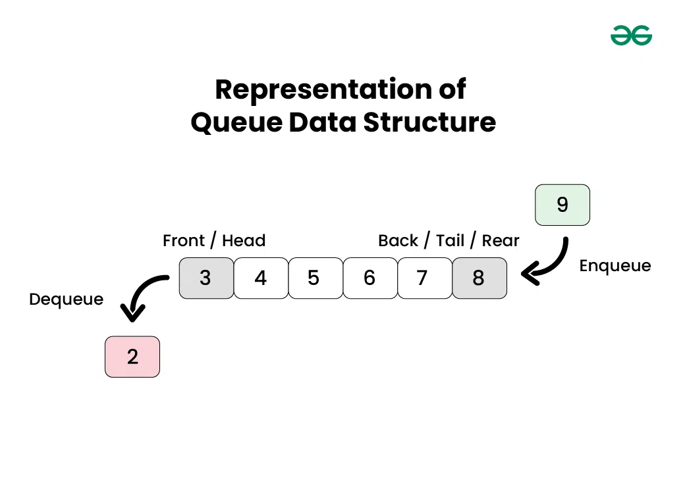

# Queue Data Structure

## What is queue?
* Queue is liner data  structure.
* Queue has two ends front and rear (tail).
* Queue worked by FIFO principle that meaning the first item add is the first item removed.



## What is basic operations in Queue?
* Enqueue -> add from front 
* Dequeue -> remove from tail
* peek    -> print the front element
* rear    -> print the tail element
* isEmpty -> check if the queue is empty or not

## Implementation queue with array?
* this is the basic way to create queue.
* the time complexity for insert and delete:
    * insert -> O(1) because you insert in the last position and you know the index you can insert on it.
    * delete -> O(n) because you delete the first element in the array and shift all element.
### Enqueue operation:
* you append new element in the last array.
### Dequeue operation:
* you remove the first element.
## Implementation queue with linked list?
* you can implement the same operation for array queue.
* the time complexity for insert or delete are O(1) 
    * insert -> O(1) because you have the address you can insert for it (rear) so you don't need to loop over nodes.
    * delete -> O(1) because you can delete from front direct.
### Enqueue operation:
1. create the new node 
2. check if the queue is empty (front == Null) 
    * you can make the front and rear equal new node 
3. make the next for end node point to the new node
4. make the rear equal new node 
### Dequeue operation:
1. if the queue  is empty:
    * you can print the message error.
2. if the queue has one empty:
    * make the end and the front equal Null
3. if queue have nodes:
    * make the front equal old front next 


## Note:
> ```
> if you want to test this code in your system you can make it local by download go dependance or you can check in (https://go.dev/play/)
> ```
